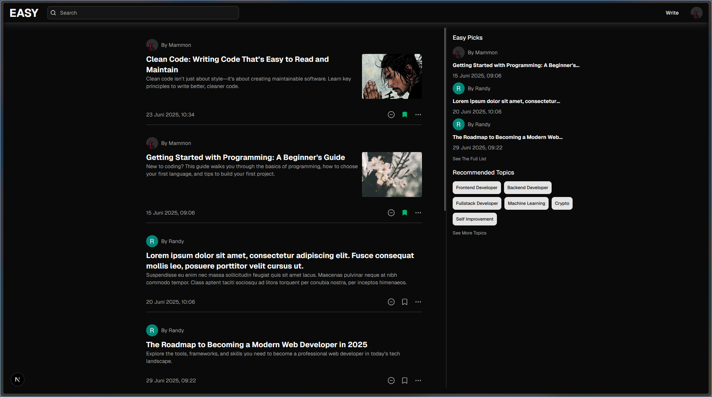
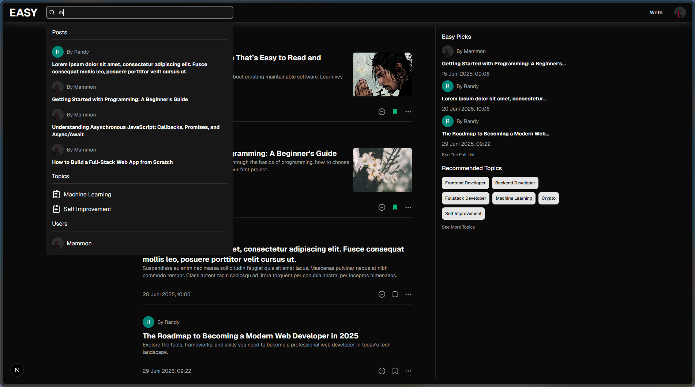
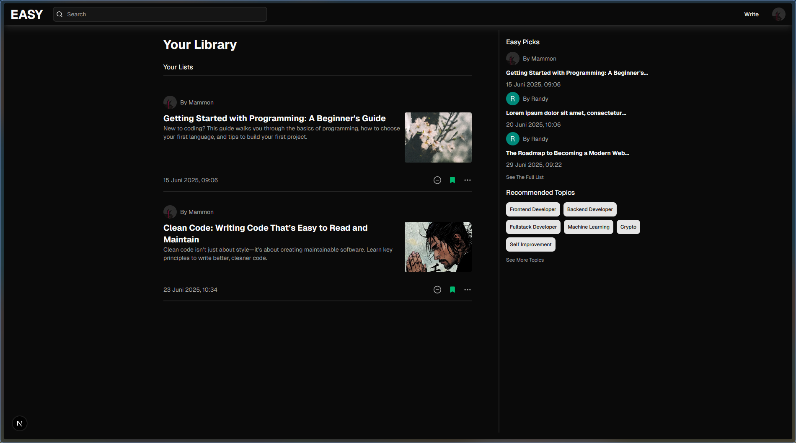
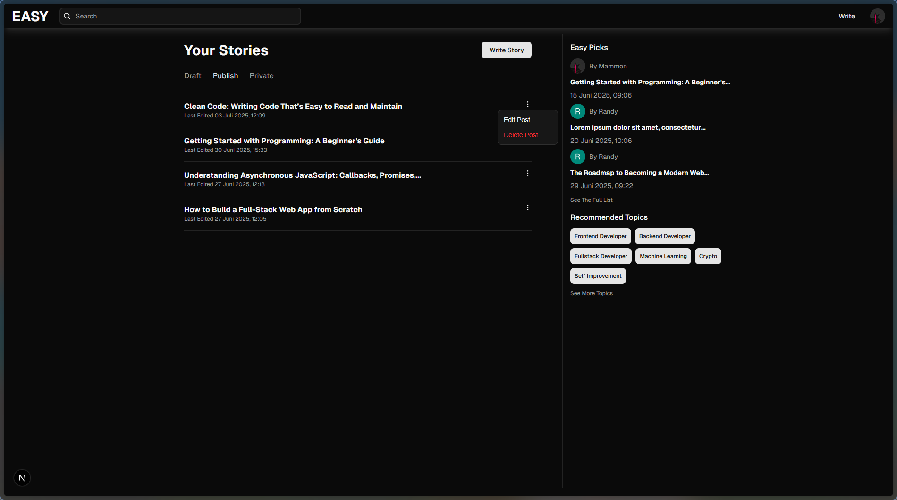
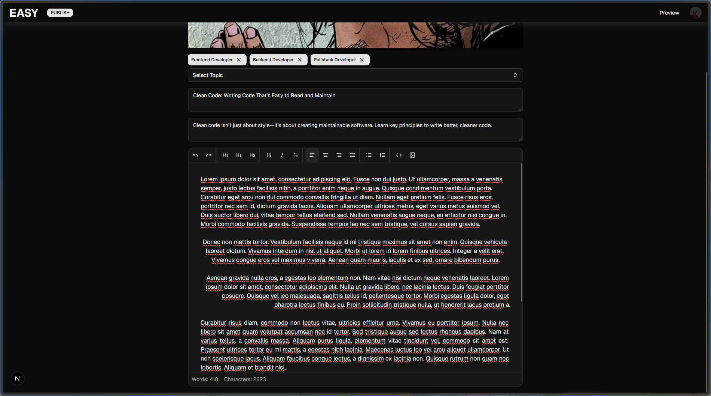
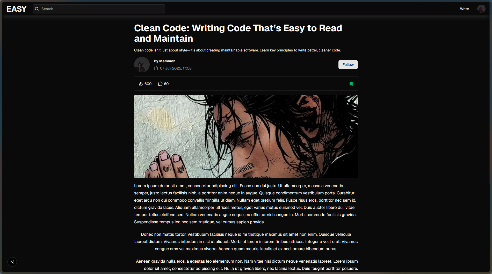

# Simple Blog Website

## Preview

<p align="center">
  
  
  <br/>
  
  
  <br/>
  
  
</p>

## 🛠 Tech Stack

### Frontend

- Next.js
- React
- TypeScript
- Tailwind CSS
- Shadcn/UI
- Zustand (State Management)

### Backend & API

- tRPC
- Prisma

### Third-Party Services

- **Clerk** – Authentication
- **Supabase** – PostgreSQL Database & Storage

### Others

- ESLint & Prettier
- Ngrok – for local webhook testing

## 🚀 Features

- Integrated Clerk for secure user sign‑in and sign‑up flows.
- Built full CRUD functionality for blog posts
- Integrated a rich text editor for enhanced post creation and editing
- Integrated Supabase Storage for efficient post image management
- Developed a search feature to help users quickly find relevant blog posts
- Implemented infinite scrolling for seamless content loading
- Added optimistic UI updates to keep the interface responsive during data mutations

## 📦 Installation

Follow these steps to get started:

### 1. Prerequisites

- Ensure you have [Node.js](https://nodejs.org/) (LTS version recommended) and npm or Yarn installed.
- Clone this repository:

```bash
git clone https://github.com/MammonXXIX/easy.git

cd FOLDER_NAME

npm install
```

### 2. Configure Environment Variables

This project requires several API credentials stored in a `.env` file.

1. Copy the `.env.example` file and rename it to `.env`:

    ```bash
    cp .env.example .env
    ```

2. Fill in the `.env` variables with your own credentials:

    - **Clerk:**

        - `NEXT_PUBLIC_CLERK_PUBLISHABLE_KEY`
        - `CLERK_SECRET_KEY`
        - `CLERK_WEBHOOK_SIGNIN_SECRET`

    - **Supabase Database (Prisma):**

        - `DATABASE_URL`
        - `DIRECT_URL`

    - **Supabase JS Client:**

        - `NEXT_PUBLIC_SUPABASE_URL`
        - `NEXT_PUBLIC_SUPABASE_ANON_KEY`
        - `SUPABASE_SERVICE_ROLE_KEY` (**KEEP THIS SECRET!**)

    - **Supabase Storage:**
        - Create a public bucket named `post-images` & `post-content-images` (or match the bucket name used in `src/server/supabase/bucket.ts`) in the Supabase Storage dashboard

### 3. Sync the Database

After setting up your `.env` file, run the following command to push the schema to your Supabase database:

```bash
npx prisma generate
```

